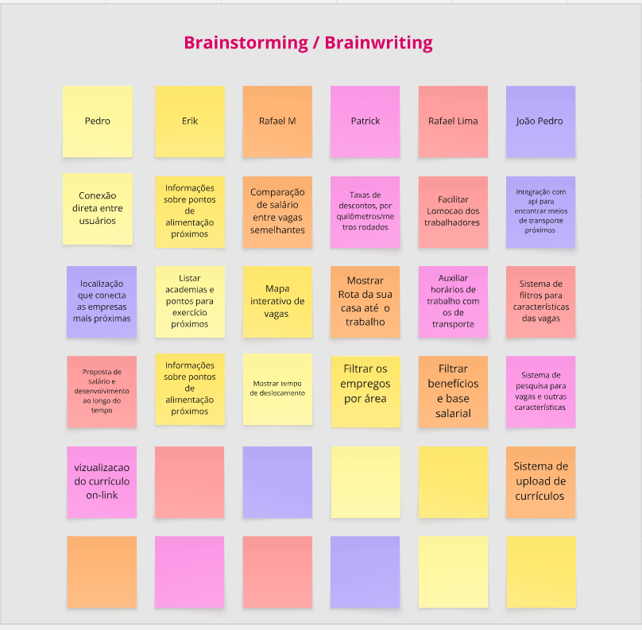
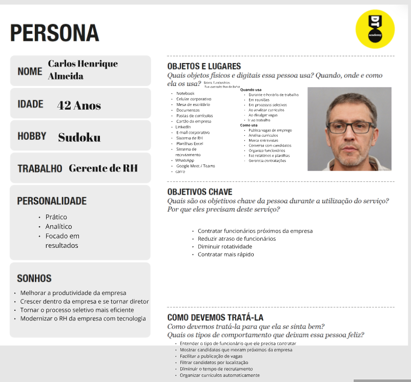
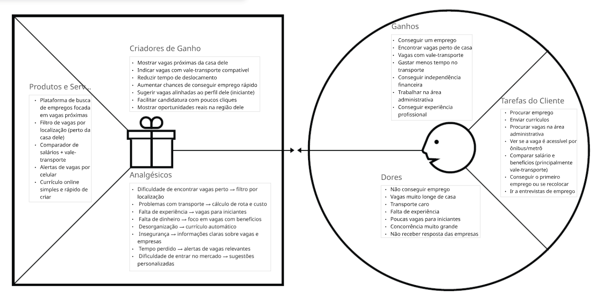
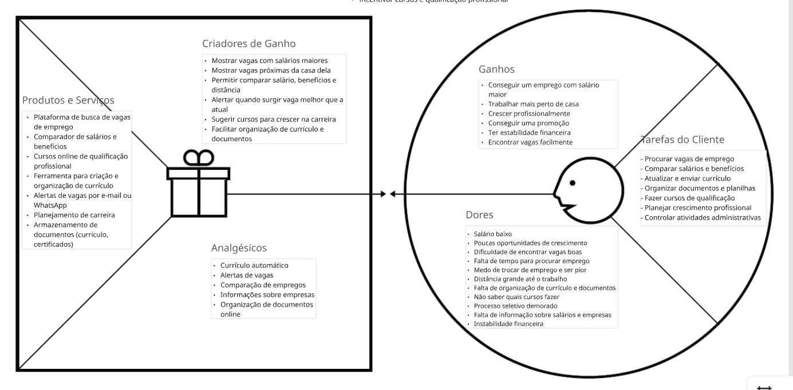
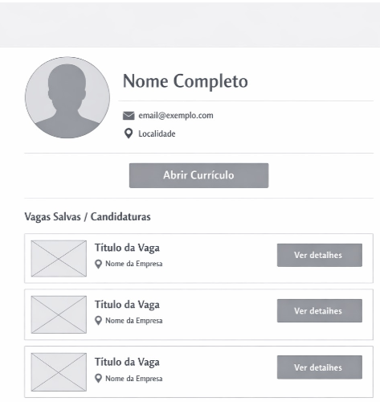
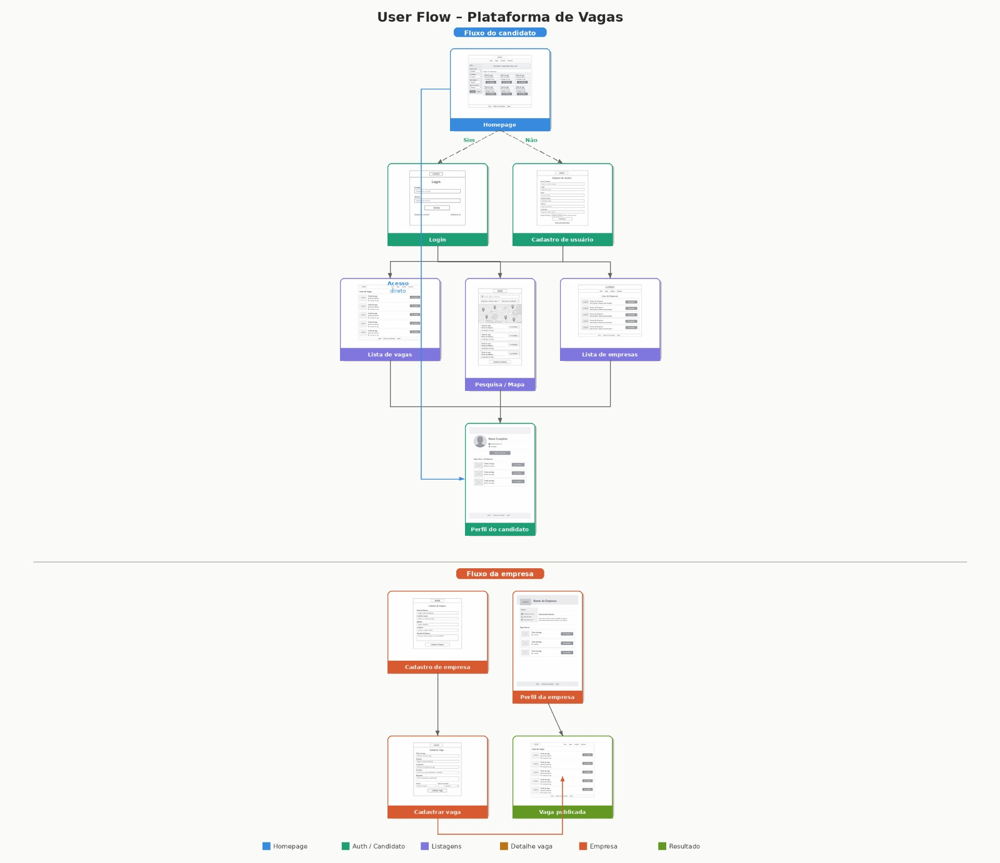

# Introdução

Informações básicas do projeto.

* **Projeto:** [BH Works]
* **Repositório GitHub:** [https://github.com/ICEI-PUC-Minas-PMGES-TI/matchdevsBh.git]
*  João Pedro Fonseca Baião
* Patrick Augusto de Oliveira
* Rafael Melo Mansur Cardoso
* Erik Vilança
* Pedro Marcos Costa
* Rafael lima Pais

  * [Patrick] [https://github.com/patrickaugustodeoliveira]
  * [João] [https://github.com/Joao-Baiao]
  * [Rafael_lima] [https://github.com/rafael012020]
  * [Rafael_melo] [https://github.com/rafaelmelomansur]
  * [Erik] [https://github.com/Kivimac]
  * [Pedro] [https://github.com/peligado]

A documentação do projeto é estruturada da seguinte forma:

1. Introdução
2. Contexto
3. Product Discovery
4. Product Design
5. Metodologia
6. Solução
7. Referências Bibliográficas

✅ [(https://github.com/patrickaugustodeoliveira)]

# Contexto

O projeto é uma plataforma digital de recrutamento voltada para o mercado brasileiro, projetada para simplificar o processo de busca e publicação de vagas. A navegação é organizada em dois fluxos distintos: um para candidatos e outro para empresas, garantindo que cada usuário encontre rapidamente o que precisa sem sobrecarga de informação.

O candidato pode explorar vagas através de listagens filtradas por tipo, localização, faixa salarial e contrato, ou visualizar oportunidades diretamente em um mapa geográfico interativo. Após encontrar uma vaga de interesse, pode salvar ou se candidatar com um clique, acompanhando tudo pelo seu perfil pessoal. Empresas, por sua vez, cadastram seu perfil institucional, publicam vagas e ficam visíveis tanto na listagem quanto no mapa.

## Problema

Atualmente, as vagas de emprego em Belo Horizonte estão
dispersas em múltiplas plataformas e canais diferentes. Isso gera
grande dificuldade para os candidatos encontrarem oportunidades
de forma rápida e eficiente, resultando em perda de tempo e
frustração na busca por emprego



## Objetivos


## Justificativa

**✳️✳️✳️ COLOQUE AQUI O SEU TEXTO ✳️✳️✳️**

> ⚠️ **APAGUE ESSA PARTE ANTES DE ENTREGAR SEU TRABALHO**
>
> Descreva a importância ou a motivação para trabalhar com esta aplicação que você escolheu. Indique as razões pelas quais você escolheu seus objetivos específicos ou as razões para aprofundar em certos aspectos do software.
>
> O grupo de trabalho pode fazer uso de questionários, entrevistas e dados estatísticos, que podem ser apresentados, com o objetivo de esclarecer detalhes do problema que será abordado pelo grupo.
>
> **Orientações**:
>
> - [Como montar a justificativa](https://guiadamonografia.com.br/como-montar-justificativa-do-tcc/)

## Público-Alvo

Nosso público alvo são empresas com dificuldade de achar funcionarios e pessoas com dificuldade de achar emprego por diferentes motivos, mesmo sendo qualificados.

# Product Discovery

## Etapa de Entendimento


## Etapa de Definição

### Personas




# Product Design


## Histórias de Usuários


## Proposta de Valor






## Requisitos
cadastro de usuário, duas telas de login(empresas e trabalhadores), conexão direta entre usuários,integração com api para encontrar meios de transporte, comparação de salário com vagas semelhantes e mapa interativo de vagas.

### Requisitos Funcionais


| RF-001 | cadastro do usuário                            |   Alta    |
| RF-002 | Duas telas de login (empresas e trabalhadores) |  MÉDIA    |
| RF-003 | conexação direta entre usúarios                |   Alta    |

### Requisitos não Funcionais


| RNF-001 | Integração com api para encontrar meios de transporte      | MÉDIA     |
| RNF-002 | comparação de salário com vagas semelhantes      | Alta     |
| RNF-003 | Mapa interativo de vagas      | Media     |

> ⚠️ **APAGUE ESSA PARTE ANTES DE ENTREGAR SEU TRABALHO**
>
> Os requisitos de um projeto são classificados em dois grupos:
>
> - [Requisitos Funcionais (RF)](https://pt.wikipedia.org/wiki/Requisito_funcional):
>   correspondem a uma funcionalidade que deve estar presente na plataforma (ex: cadastro de usuário).
> - [Requisitos Não Funcionais (RNF)](https://pt.wikipedia.org/wiki/Requisito_n%C3%A3o_funcional):
>   correspondem a uma característica técnica, seja de usabilidade, desempenho, confiabilidade, segurança ou outro (ex: suporte a dispositivos iOS e Android).
>
> Lembre-se que cada requisito deve corresponder à uma e somente uma característica alvo da sua solução. Além disso, certifique-se de que todos os aspectos capturados nas Histórias de Usuário foram cobertos.
>
> **Orientações**:
>
> - [O que são Requisitos Funcionais e Requisitos Não Funcionais?](https://codificar.com.br/requisitos-funcionais-nao-funcionais/)
> - [O que são requisitos funcionais e requisitos não funcionais?](https://analisederequisitos.com.br/requisitos-funcionais-e-requisitos-nao-funcionais-o-que-sao/)

## Projeto de Interface

Artefatos relacionados com a interface e a interacão do usuário na proposta de solução.

### Wireframes




### User Flow





### Protótipo Interativo

protótipo interativo 

[https://marvelapp.com/prototype/aihe1fa]

# Metodologia

Detalhes sobre a organização do grupo e o ferramental empregado.

## Ferramentas

Relação de ferramentas empregadas pelo grupo durante o projeto.

| Ambiente                    | Plataforma | Link de acesso                                     |
| --------------------------- | ---------- | -------------------------------------------------- |
| Processo de Design Thinking | Miro       | https://miro.com/XXXXXXX ⚠️ EXEMPLO ⚠️        |
| Repositório de código     | GitHub     | https://github.com/XXXXXXX ⚠️ EXEMPLO ⚠️      |
| Hospedagem do site          | Render     | https://site.render.com/XXXXXXX ⚠️ EXEMPLO ⚠️ |
| Protótipo Interativo       | MarvelApp  | https://marvelapp.com/XXXXXXX ⚠️ EXEMPLO ⚠️   |
|                             |            |                                                    |

> ⚠️ **APAGUE ESSA PARTE ANTES DE ENTREGAR SEU TRABALHO**
>
> Liste as ferramentas empregadas no desenvolvimento do projeto, justificando a escolha delas, sempre que possível. Inclua itens como: (1) Editor de código, (2) )ferramentas de comunicação, (3) )ferramentas de diagramação, (4) )plataformas de hospedagem, entre outras.

## Gerenciamento do Projeto

Divisão de papéis no grupo e apresentação da estrutura da ferramenta de controle de tarefas (Kanban).

.png)
> - [Gestão de projetos com GitHub | balta.io](https://balta.io/blog/gestao-de-projetos-com-github)
> - [(460) GitHub Projects - YouTube](https://www.youtube.com/playlist?list=PLiO7XHcmTsldZR93nkTFmmWbCEVF_8F5H)
> - [11 Passos Essenciais para Implantar Scrum no seu Projeto](https://mindmaster.com.br/scrum-11-passos/)
> - [Scrum em 9 minutos](https://www.youtube.com/watch?v=XfvQWnRgxG0)

# Solução Implementada

Esta seção apresenta todos os detalhes da solução criada no projeto.

## Vídeo do Projeto

O vídeo a seguir traz uma apresentação do problema que a equipe está tratando e a proposta de solução. ⚠️ EXEMPLO ⚠️

[](https://www.youtube.com/embed/70gGoFyGeqQ)

> ⚠️ **APAGUE ESSA PARTE ANTES DE ENTREGAR SEU TRABALHO**
>
> O video de apresentação é voltado para que o público externo possa conhecer a solução. O formato é livre, sendo importante que seja apresentado o problema e a solução numa linguagem descomplicada e direta.
>
> Inclua um link para o vídeo do projeto.

## Funcionalidades

Esta seção apresenta as funcionalidades da solução.Info

##### Funcionalidade 1 - Cadastro de Contatos ⚠️ EXEMPLO ⚠️

Permite a inclusão, leitura, alteração e exclusão de contatos para o sistema

* **Estrutura de dados:** [Contatos](#ti_ed_contatos)
* **Instruções de acesso:**
  * Abra o site e efetue o login
  * Acesse o menu principal e escolha a opção Cadastros
  * Em seguida, escolha a opção Contatos
* **Tela da funcionalidade**:


> ⚠️ **APAGUE ESSA PARTE ANTES DE ENTREGAR SEU TRABALHO**
>
> Apresente cada uma das funcionalidades que a aplicação fornece tanto para os usuários quanto aos administradores da solução.
>
> Inclua, para cada funcionalidade, itens como: (1) titulos e descrição da funcionalidade; (2) Estrutura de dados associada; (3) o detalhe sobre as instruções de acesso e uso.

## Estruturas de Dados

Descrição das estruturas de dados utilizadas na solução com exemplos no formato JSON.Info

##### Estrutura de Dados - Contatos   ⚠️ EXEMPLO ⚠️

Contatos da aplicação

```json
  {
    "id": 1,
    "nome": "Leanne Graham",
    "cidade": "Belo Horizonte",
    "categoria": "amigos",
    "email": "Sincere@april.biz",
    "telefone": "1-770-736-8031",
    "website": "hildegard.org"
  }
  
```

##### Estrutura de Dados - Usuários  ⚠️ EXEMPLO ⚠️

Registro dos usuários do sistema utilizados para login e para o perfil do sistema

```json
  {
    id: "eed55b91-45be-4f2c-81bc-7686135503f9",
    email: "admin@abc.com",
    id: "eed55b91-45be-4f2c-81bc-7686135503f9",
    login: "admin",
    nome: "Administrador do Sistema",
    senha: "123"
  }
```

> ⚠️ **APAGUE ESSA PARTE ANTES DE ENTREGAR SEU TRABALHO**
>
> Apresente as estruturas de dados utilizadas na solução tanto para dados utilizados na essência da aplicação quanto outras estruturas que foram criadas para algum tipo de configuração
>
> Nomeie a estrutura, coloque uma descrição sucinta e apresente um exemplo em formato JSON.
>
> **Orientações:**
>
> * [JSON Introduction](https://www.w3schools.com/js/js_json_intro.asp)
> * [Trabalhando com JSON - Aprendendo desenvolvimento web | MDN](https://developer.mozilla.org/pt-BR/docs/Learn/JavaScript/Objects/JSON)

## Módulos e APIs

Esta seção apresenta os módulos e APIs utilizados na solução

**Images**:

* Unsplash - [https://unsplash.com/](https://unsplash.com/) ⚠️ EXEMPLO ⚠️

**Fonts:**

* Icons Font Face - [https://fontawesome.com/](https://fontawesome.com/) ⚠️ EXEMPLO ⚠️

**Scripts:**

* jQuery - [http://www.jquery.com/](http://www.jquery.com/) ⚠️ EXEMPLO ⚠️
* Bootstrap 4 - [http://getbootstrap.com/](http://getbootstrap.com/) ⚠️ EXEMPLO ⚠️

> ⚠️ **APAGUE ESSA PARTE ANTES DE ENTREGAR SEU TRABALHO**
>
> Apresente os módulos e APIs utilizados no desenvolvimento da solução. Inclua itens como: (1) Frameworks, bibliotecas, módulos, etc. utilizados no desenvolvimento da solução; (2) APIs utilizadas para acesso a dados, serviços, etc.

# Referências

As referências utilizadas no trabalho foram:

* SOBRENOME, Nome do autor. Título da obra. 8. ed. Cidade: Editora, 2000. 287 p ⚠️ EXEMPLO ⚠️

> ⚠️ **APAGUE ESSA PARTE ANTES DE ENTREGAR SEU TRABALHO**
>
> Inclua todas as referências (livros, artigos, sites, etc) utilizados no desenvolvimento do trabalho.
>
> **Orientações**:
>
> - [Formato ABNT](https://www.normastecnicas.com/abnt/trabalhos-academicos/referencias/)
> - [Referências Bibliográficas da ABNT](https://comunidade.rockcontent.com/referencia-bibliografica-abnt/)
